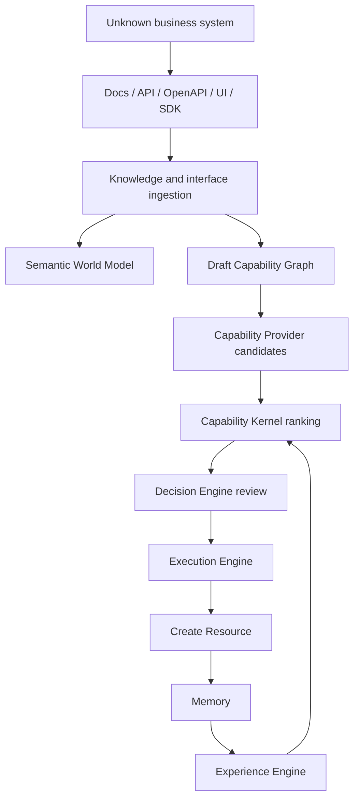
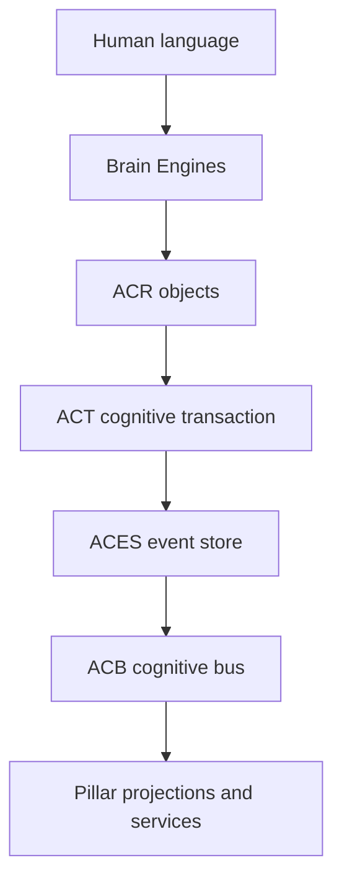

# Explaining Atlas AIOS To Someone New

**Audience:** A technical or product-minded person who has never seen Atlas before  
**Purpose:** Help someone understand the vision, architecture, MVP, and current development direction without drowning them in terminology  
**Tone:** Clear, ambitious, practical, and interesting enough to keep reading

---

## The Short Version

Atlas AIOS is a capability-first cognitive operating system.

That sounds large, so say it plainly:

Atlas is being built to become a governed digital counterpart that can understand goals, plan work, choose the right tools or interfaces, execute tasks, learn from experience, and improve over time without becoming an uncontrolled black box.

It is not just a chatbot.

It is not just automation.

It is not a collection of app-specific agents.

Atlas is an attempt to build an AI system that can operate across software the way a capable human operator does: by understanding intent, learning interfaces, making decisions, asking for approval when needed, and carrying work forward under explicit governance.

The north star is simple:

```text
One day, the user should be able to say:

"You know what needs to be done."

Atlas should understand the context, prepare a plan, explain the risks, ask for required approvals, and own execution.
```

## Why Atlas Exists

Most current AI tools are powerful but fragmented.

One tool writes code. Another summarizes documents. Another calls APIs. Another controls a browser. Another stores memory. Another schedules work.

The human still has to orchestrate everything:

- explain the goal
- provide context
- choose tools
- watch for mistakes
- remember prior failures
- approve risky actions
- retry when things break
- turn lessons into future behavior

Atlas is designed to move that orchestration layer into the system itself.

The goal is not to replace the human. The goal is to reduce repeated explanation and manual coordination. Atlas should become more useful because it learns how the user thinks, builds, manages, communicates, and decides.

## The Big Idea: Capabilities, Not Apps

The most important architectural idea in Atlas is this:

Atlas should not be built around named applications.

It should be built around capabilities.

Most automation systems think like this:

```text
Use GitHub
Use Gmail
Use browser
Use SAP
Use Slack
```

Atlas should think like this:

```text
Goal
-> Required capability
-> Possible providers
-> Interface driver
-> Execution environment
```

For example:

```text
Capability: Create Invoice

Possible providers:
- ERP API provider
- browser UI provider
- desktop UI provider
- generated workflow provider
- human provider
- another Atlas instance
```

Atlas should not care whether the provider happens to be SAP, ERPNext, a website, a CLI, a local desktop app, or a robot. Those are implementation details.

This is what makes Atlas universal.

The first impressive demo should not be:

```text
Atlas learned one app.
```

It should be:

```text
Atlas learned an unknown system from its interfaces and executed a capability without handwritten app-specific code.
```

## The MVP

The MVP is intentionally narrow but important.

Atlas should learn a deliberately generic unknown business system and execute one universal capability:

```text
Create Resource
```

The unknown system may expose:

- documentation
- REST API
- OpenAPI spec
- browser UI
- SDK
- CLI
- MCP server
- database or files

Atlas should ingest those interfaces, infer entities and capabilities, generate provider definitions, test them, and execute `Create Resource` under governance.

The MVP flow looks like this:



If that works, Atlas proves the central thesis: it can learn software through interfaces instead of requiring hardcoded application agents.

## What Makes Atlas Different From Automation

Automation executes predefined instructions.

Atlas should continuously reason.

Automation stops when it hits something unexpected.

Atlas should adapt, ask, simulate, retry, or escalate.

Automation needs a human to orchestrate workflows.

Atlas should own goals.

That distinction matters. A workflow tool can run a script. Atlas should understand why the script exists, whether it is still the right approach, what risks changed, whether approval is needed, and what experience says about similar work.

## The Twelve Pillars

Atlas is organized around twelve pillars. Each pillar owns a specific part of the system so the architecture does not become one giant agent prompt.

### 1. Brain Engines

Brain Engines handle reasoning, planning, context building, clarification, plan explanation, and structured outputs.

They do not directly execute tools.

They answer:

```text
What is the goal?
What context matters?
What plan makes sense?
What decisions are unclear?
What risks need approval?
```

### 2. Capability Kernel

The Capability Kernel resolves requested capabilities into provider options.

It ranks providers using:

- capability fit
- confidence
- policy risk
- permission fit
- prior experience
- cost
- latency
- reputation
- fallback availability

It answers:

```text
Which provider should Atlas use for this capability right now?
```

### 3. Autonomous Goal Ownership Engine

AGOE owns goals from creation to completion.

It tracks:

- goal status
- decomposition
- blockers
- waiting states
- priority
- recovery
- completion criteria

It answers:

```text
What work does Atlas own, what is blocked, and what should happen next?
```

### 4. Semantic World Model

The Semantic World Model stores meaning.

It represents:

- entities
- relationships
- ontology
- provenance
- confidence
- temporal validity

It answers:

```text
What does Atlas understand about the world and how things relate?
```

### 5. World State

World State tracks current operational reality.

It represents:

- active goals
- active executions
- blockers
- deadlines
- incidents
- waiting states
- workload

It answers:

```text
What is happening right now?
```

### 6. Memory

Memory records what happened.

It stores raw evidence such as:

- decisions
- conversations
- execution events
- approvals
- rejections
- corrections
- failures
- meeting notes

It answers:

```text
What happened before, and what evidence do we have?
```

### 7. Experience Engine

Experience is not raw memory. It is distilled professional knowledge.

Memory might say:

```text
Provider X failed twice when required fields were inferred from UI labels.
```

Experience turns that into:

```text
Do not trust this provider for Create Resource unless field mappings are validated first.
```

The Experience Engine produces:

- heuristics
- playbooks
- anti-patterns
- decision patterns
- risk patterns

It answers:

```text
What has Atlas learned from prior work that should influence the next plan?
```

### 8. Capability Graph

The Capability Graph represents what Atlas can do and how capabilities compose.

It tracks:

- capabilities
- dependencies
- providers
- maturity
- confidence
- composition paths

It answers:

```text
What can Atlas do, and how can capabilities combine to achieve a goal?
```

### 9. Identity Engine

Identity resolves humans, systems, organizations, providers, aliases, and external accounts.

It prevents unsafe assumptions like treating two similar names as the same actor.

It answers:

```text
Who or what is this, and how confident are we?
```

### 10. Self Model

The Self Model tracks what Atlas believes about its own abilities.

It includes:

- available capabilities
- provider confidence
- known limitations
- known failure modes
- granted authority
- resource limits
- subsystem maturity

It answers:

```text
What does Atlas know it can and cannot safely do?
```

### 11. Learning & Governance System

Learning & Governance makes improvement safe.

It owns:

- policies
- approvals
- audit rules
- critic reports
- defender reports
- judge validation
- promotion gates

It answers:

```text
Is this action or system change allowed, validated, explainable, and auditable?
```

### 12. Cognitive Loop

The Cognitive Loop coordinates everything.

It cycles through:

```text
observe
-> update world state
-> update semantic world model
-> record memory
-> distill experience
-> update self model
-> review goals
-> allocate attention
-> plan
-> simulate
-> execute
-> evaluate
-> learn
-> rest
```

It answers:

```text
How does Atlas keep thinking, acting, learning, and staying bounded over time?
```

## The Cognitive Representation Stack

Atlas should not pass giant natural-language prompts between internal systems.

Natural language is useful at the boundary. Internally, Atlas needs structured cognition.

That is where ACR, ACT, ACES, and ACB come in.



### ACR: Atlas Cognitive Representation

ACR is the object model for cognition.

Instead of passing vague text like:

```text
The user wants to create a billing resource and maybe needs approval.
```

Atlas should create typed objects:

```text
Goal
Decision
Capability
Risk
ApprovalRequirement
Execution
Memory
Experience
```

Each object should be:

- typed
- versioned
- evidence-backed
- replayable
- explainable
- provider-independent
- model-independent

### ACT: Atlas Cognitive Transaction

ACT is like a database transaction or Git commit for cognition.

If the Brain creates a goal, thought, decision, relationship, world-state update, and execution start as part of one reasoning step, those events should commit together.

Example:

```text
ACT-000142
+ goal.created
+ thought.created
+ decision.created
+ relationship.added
+ world.updated
+ execution.started
```

This gives Atlas:

- atomic cognition
- consistent replay
- easier debugging
- rollback before publication
- strong auditability

### ACES: Atlas Cognitive Event Store

ACES is the source of truth.

Atlas should not treat mutable database rows as the ultimate record of what happened. Instead, committed cognitive events are canonical. Relational, graph, search, and vector stores are projections that can be rebuilt.

### ACB: Atlas Cognitive Bus

ACB publishes committed cognitive changes to the rest of the system.

It should move compact object references and event metadata, not giant prompt blobs.

## Decision Engine: Power With Judgment

Atlas should be allowed to attempt anything that can be done, but it should not act blindly.

The Decision Engine is the active reviewer between planning and execution.

It receives:

- what Atlas wants to do
- why it wants to do it
- what authority applies
- what risks exist
- what alternatives exist
- what evidence supports the action

It can respond:

- approve
- approve with constraints
- discuss with the user
- suggest a better approach
- simulate first
- reject
- delegate to a human

Important point:

Memory can challenge a decision, but Memory does not become the final judge. If Memory rejects a proposed action because prior evidence says it is unsafe or duplicated, the action goes back to the Decision Engine with the rejection reason.

The Decision Engine remains the place where Atlas decides how to proceed.

## Execution Engine: Doing The Work

Once a decision is approved or constrained, the Execution Engine owns runtime behavior.

It handles:

- workflow validation
- sequential execution
- parallel execution
- provider calls
- retries
- checkpointing
- waiting states
- approval nodes
- rollback
- compensation
- streaming execution events

The Brain decides what should be done. The Kernel chooses providers. The Decision Engine judges whether to proceed. The Execution Engine runs the workflow.

That separation keeps the system understandable.

## Provider Runtime And Interface Drivers

Atlas talks to the outside world through capability providers and interface drivers.

A capability provider exposes a capability.

An interface driver knows how to operate an interface.

Examples:

```text
Capability: Create Resource
Provider: Generated OpenAPI Provider
Interface Driver: REST/OpenAPI
Execution Environment: sandbox or live system
```

Other possible interface drivers:

- REST
- OpenAPI
- GraphQL
- MCP
- browser UI
- desktop UI
- CLI
- filesystem
- local OS APIs
- database
- message queue
- robot or device interface
- human provider

This is why Atlas can stay universal. The core does not need to know every application. It needs stable contracts for capabilities, providers, drivers, and governance.

### Coding Providers

Atlas should be able to code, but it should not become a second expensive AI IDE.

Coding is modeled as a capability:

```text
Capability: Modify Code
Provider options:
- Codex-style coding provider
- Claude-Code-style coding provider
- local code agent
- human code review provider
```

The Capability Kernel chooses among those providers using cost, latency, repository permissions, privacy, task difficulty, prior success, and governance rules.

This means Atlas can ask a coding platform to perform implementation work without putting every coding task through the most expensive general reasoning lane. Simple tasks can use cheaper/local providers. Difficult architecture or risky repo changes can use stronger providers or require human review.

## Memory, Experience, And Cost Control

One of the biggest problems with large AI systems is cost.

If every task sends all memory, identity, world state, project history, and documentation into a large model, every request becomes slow and expensive.

Atlas avoids that by storing cognition outside the model.

The Brain should ask:

```text
What context do I need for this decision?
```

Then it retrieves only relevant context from:

- Memory
- Experience
- Semantic World Model
- World State
- Identity
- Self Model
- Capability Graph
- Governance
- vector search
- graph queries
- relational projections

This means the model does not need to remember everything in its prompt. Atlas can store durable knowledge externally, retrieve compact context, and use strong models only when the task actually requires deep reasoning.

## Model Strategy

Atlas should not rely on one model for everything.

The model strategy is:

1. Use deterministic code for validation, rankings, permissions, state machines, retries, and storage.
2. Use small efficient models for classification, extraction, summarization, and routing.
3. Use stronger reasoning models for hard planning, architecture, governance-sensitive tradeoffs, and difficult debugging.
4. Use specialized models for embeddings, reranking, vision grounding, UI control, and code generation.
5. Treat models as providers that can be ranked by cost, latency, quality, risk, and privacy.

Optional remote models, such as NVIDIA-hosted Nemotron-style reasoning endpoints, should be used only for big or difficult requests where privacy and governance allow it.

Local models remain important because Atlas should be able to run private, low-latency, low-cost reasoning for everyday work.

## Tools, Models, And Research Tracks

Atlas is not one model and one app. It is a system made from deterministic runtime code, storage layers, retrieval systems, interface drivers, model providers, visual grounding tools, and governance checks.

The important rule is:

```text
Every model or tool is a provider.
Providers are ranked by capability, cost, latency, privacy, reliability, policy fit, and prior experience.
```

### Runtime And Development Stack

The current implementation stack is intentionally practical:

- TypeScript monorepo
- pnpm workspace
- package-level pillar boundaries
- deterministic unit tests
- formatting, linting, type-checking, and CI
- PostgreSQL schema baseline for durable projections
- event-first ACR and ACT contracts in the core package
- in-memory deterministic projectors before database-backed services

This keeps Atlas grounded. The project is not starting with a giant autonomous agent. It is building contracts, tests, and runtime layers first.

### Storage And Retrieval Tools

Atlas needs large memory without sending everything into the LLM on every request.

The intended storage strategy is:

- event store for canonical cognitive history
- PostgreSQL for operational projections
- graph database or graph projections for relationships and traversal
- vector database for semantic retrieval
- BM25 or keyword search for exact lexical retrieval
- object storage for raw evidence such as logs, screenshots, documents, traces, and uploaded files

The Brain should retrieve compact context instead of carrying everything in the prompt.

Example:

```text
Task: Create Resource

Brain asks for:
- relevant capability graph nodes
- current blockers
- prior failures
- provider confidence
- identity context
- governance constraints
- related documentation chunks

Brain should not ask for:
- every memory
- every document
- every screenshot
- every prior conversation
```

### Main Local Reasoning Models

Atlas should prefer local or self-hosted models for most private daily work.

Local models are useful for:

- planning drafts
- extraction
- classification
- summarization
- routing
- code understanding
- structured ACR draft generation
- low-risk repeated reasoning

The current architecture keeps this as the default lane:

```text
local-default
```

This lane should be optimized for privacy, cost, and latency.

Candidate local/open model families can include Qwen-style reasoning/coder models, Llama-style general models, DeepSeek-style coder/reasoning models, and other benchmarked open models as they become practical. Atlas should not choose by hype. It should benchmark them against Atlas tasks:

- strict ACR output
- AtlasFlow generation
- provider selection reasoning
- code modification
- interface understanding
- low-hallucination planning
- latency on available hardware

### NVIDIA Nemotron / NIM Reasoning Lane

Nemotron is tracked as an optional high-difficulty reasoning provider, not the default brain.

The current research direction includes the NVIDIA Nemotron 3 family, including Super and Ultra-class variants where available, exposed through NVIDIA NIM or other OpenAI-compatible endpoints.

Atlas should use this kind of remote reasoning lane only when:

- the task is difficult
- the privacy class allows remote processing
- the user or policy allows hosted endpoints
- local models are likely to be too weak or too slow
- the result will still be validated by deterministic Atlas contracts

Example routing:

```text
Normal task
-> local-default

Hard architecture / planning / debugging task
-> optional remote-deep-reasoning
-> NVIDIA Nemotron / NIM candidate
-> deterministic validation before trust
```

Nemotron-style models are interesting because they target agentic reasoning, long context, tool use, and reasoning-budget control. Atlas should still treat them as replaceable providers.

The key principle:

```text
Nemotron can help reason.
It should not become Atlas's architecture.
```

### TurboQuant And Memory Efficiency

TurboQuant is tracked as a research candidate for memory and inference efficiency.

The reason it matters:

Large context and long-running memory can become expensive fast. If Atlas eventually maintains long active sessions, rich memory, UI histories, screenshots, workflow traces, and retrieved documents, model serving and retrieval storage can become heavy.

TurboQuant-style compression may help in two places:

- KV-cache compression for long-context inference
- vector compression for semantic memory and retrieval indexes

Atlas should evaluate it against practical questions:

- Does it reduce memory enough to matter?
- Does retrieval quality stay high?
- Does long-context reasoning degrade?
- Is there a production-ready implementation?
- Can it run on the hardware Atlas expects to use?
- Does it help more than simply using better retrieval and smaller context packets?

This is important because Atlas should not solve memory by dumping everything into a huge prompt. It should use structured memory, retrieval, and compression together.

### Desktop Vision And Computer Control

Atlas eventually needs to control computers like a capable human operator.

That requires more than browser automation. It needs visual grounding, UI understanding, deterministic safety checks, and execution drivers.

Candidate visual and desktop-control tools include:

- LocateAnything for fast general visual grounding and region localization
- SeeClick-style screenshot-based GUI grounding
- ScreenSpot-Pro-style evaluation for high-resolution professional UI grounding
- Agent S2-style generalist/specialist GUI agent patterns
- GroundCUA or GroundNext-style desktop grounding research
- OCR for text extraction
- accessibility-tree inspection where available
- browser DOM inspection where available
- Playwright-style browser control for web interfaces
- coordinate validation before mouse/keyboard actions
- screenshot and state comparison after actions

The best Atlas design is probably not one vision model.

It should be a grounding cascade:

```text
Accessibility tree
-> DOM or UI automation API
-> OCR
-> GUI-specialized grounding model
-> general visual grounding model such as LocateAnything
-> deterministic coordinate validation
-> action execution
-> screenshot/state verification
```

This prevents Atlas from acting like a laggy visual bot that blindly clicks coordinates. The goal is controlled computer use:

- understand the UI
- locate the target
- verify the target
- execute the action
- observe the result
- recover if the result is wrong

### Interface And Integration Tools

Atlas should learn software from interfaces.

Important interface sources include:

- OpenAPI
- REST
- GraphQL
- gRPC
- MCP
- browser UI
- desktop UI
- CLI
- SDKs
- database schemas
- filesystems
- local OS APIs
- IPC
- message queues

The MVP should prioritize:

1. REST driver
2. OpenAPI parser and driver
3. browser UI observation
4. generated provider manifest
5. provider contract tests
6. simulation before real execution

MCP is especially useful as a boundary protocol for tool discovery, but Atlas should not make MCP the internal architecture. MCP tools should compile into Atlas capabilities, providers, permissions, tests, and benchmarks.

### Evaluation And Benchmark Tools

Atlas should benchmark tools before trusting them.

Useful evaluation tracks include:

- strict JSON or ACR output success rate
- planning correctness
- provider selection correctness
- cost per completed task
- latency per completed task
- safe-action rate for desktop control
- UI grounding accuracy
- rollback and compensation success
- memory retrieval precision
- experience usefulness
- governance false-positive and false-negative rates

The question is not:

```text
Which model looks smartest?
```

The question is:

```text
Which provider helps Atlas complete governed work correctly, cheaply, quickly, and safely?
```

### Adaptive Interface Specialists

Atlas should become faster and cheaper on systems it has already learned.

If a user asks Atlas to work on `abc.com`, Atlas should not fine-tune a model immediately. First it should gather evidence:

```text
abc.com docs, UI, API, SDK, workflows, screenshots, DOM, and errors
-> Site Knowledge Pack
-> Semantic World Model entities
-> Capability Graph
-> Interface Driver mappings
-> Capability Provider candidates
-> tests and benchmarks
-> Memory events
-> Experience artifacts
```

After repeated successful and failed tasks, Atlas can build a specialist dataset:

```text
interface observations
+ successful workflows
+ failed workflows
+ user corrections
+ approvals and rejections
+ field mappings
+ navigation paths
+ API schemas
+ test cases
```

A training provider such as Tinker/Inkling could then fine-tune or adapt a smaller specialist model:

```text
abc.com specialist model
+ abc.com interface driver mappings
+ abc.com capability provider
+ abc.com tests
+ abc.com benchmarks
+ abc.com experience pack
```

The specialist helps with future tasks on that site, but it does not become the source of truth. The source of truth remains ACR, Memory, Experience, Capability Graph, interface maps, and tests.

The specialist must be:

- benchmarked before promotion
- approved by governance before private-data training
- routed through Capability Kernel
- validated by deterministic checks
- monitored for drift
- demoted or retired when stale

This gives Atlas compounding learning:

```text
First task on a site = research and learning
Repeated tasks = provider and workflow reuse
Frequent task family = specialist fine-tuning
Future work = faster, cheaper, more reliable execution
```

## Current Implementation State

The current implementation lives in the `atlas` TypeScript monorepo.

It already includes packages for the major pillars:

- core
- brain
- capability-kernel
- capability-graph
- decision-engine
- execution-engine
- providers-sdk
- interface-drivers
- workflow-dsl
- swm
- world-state
- memory
- experience
- identity
- self-model
- governance
- cognitive-loop
- observability

Major pieces already implemented or started include:

- workspace setup
- formatting, linting, type-checking, and tests
- core pillar contracts
- ACR and ACT contracts
- ACR event log and projections
- Atlas Cognitive Bus publication guard
- Decision Engine baseline
- Memory decision records
- Memory rejection feedback into Decision Engine
- Experience distillation from decision memory
- Capability Kernel provider ranking
- cost and latency scoring
- permission and policy scoring
- reputation-aware provider ranking
- fallback provider selection
- Execution Engine retries, checkpoints, waiting states, rollback, and compensation
- Provider SDK execution wrapper
- REST interface driver
- Brain model routing
- optional remote deep reasoning lane
- Brain context lookup adapters for SWM, World State, Memory, Self Model, and Identity

The implementation is not yet a user-facing app. It is becoming a tested internal engine.

## What Is Still Missing Before The MVP Feels Real

The strongest path to MVP is:

1. Finish Brain context lookups.
2. Implement Goal Engine MVP through AGOE.
3. Implement Capability Graph storage and traversal.
4. Build the unknown business system fixture.
5. Add OpenAPI ingestion and driver generation.
6. Generate draft capability providers from interface evidence.
7. Wire Kernel, Decision Engine, Execution Engine, and Provider SDK into one runnable flow.
8. Add a CLI or minimal API to run the demo.
9. Benchmark `Create Resource`.
10. Record results into Memory and distill Experience.

The first useful demo should show:

```text
Input:
Here is an unknown system with docs and OpenAPI.

Atlas:
- discovers entities
- discovers Create Resource
- builds a draft capability graph
- creates provider candidates
- ranks providers
- asks for approval if needed
- executes in simulation
- executes for real if approved
- records memory
- updates experience
```

## How To Explain Atlas In A Conversation

If you need to explain Atlas to someone in two minutes, use this:

```text
Atlas is a governed AI operating system for digital work.

Instead of building one agent per app, Atlas is capability-first. It starts from a goal, identifies the capability needed, finds or generates providers that can perform that capability, chooses the safest and most efficient provider, gets approval when needed, executes through an interface driver, and learns from the result.

The long-term goal is a digital counterpart that understands how I work and can own execution under my governance.

The MVP proves this by learning an unknown business system from its interfaces and executing a generic Create Resource capability without app-specific code.
```

If they ask why it matters:

```text
Because the future is not one chatbot that knows everything.
The future is systems that can understand goals, operate tools, remember outcomes, learn patterns, and remain governed.
Atlas is trying to build that operating layer.
```

If they ask what is technically unique:

```text
Atlas turns cognition into structured, typed, evidence-backed objects.
It does not just pass prompts between agents.
It uses ACR objects, ACT cognitive transactions, an event-first source of truth, and capability-first execution.
```

If they ask what the risk is:

```text
The hard part is making it useful without making it vague.
That is why Atlas is being built with deterministic contracts, tests, explicit service boundaries, governance gates, and a narrow MVP.
```

## The Best Mental Model

Think of Atlas like an operating system for AI work.

An operating system does not only run one app. It manages processes, permissions, memory, devices, files, scheduling, errors, and communication.

Atlas should do something similar for cognition:

- goals instead of processes
- capabilities instead of app commands
- providers instead of device drivers
- Memory and Experience instead of raw logs
- ACR objects instead of prompt strings
- ACT commits instead of untracked reasoning
- governance instead of blind execution
- Cognitive Loop instead of one-shot prompting

That is the project.

Atlas is not trying to be a better chatbot.

Atlas is trying to become the control layer for intelligent digital work.

## One-Line Closing

Atlas is a capability-first, governed Cognitive Operating System that learns unknown software interfaces, owns goals, executes through providers, remembers outcomes, distills experience, and gradually becomes a trustworthy digital counterpart.
