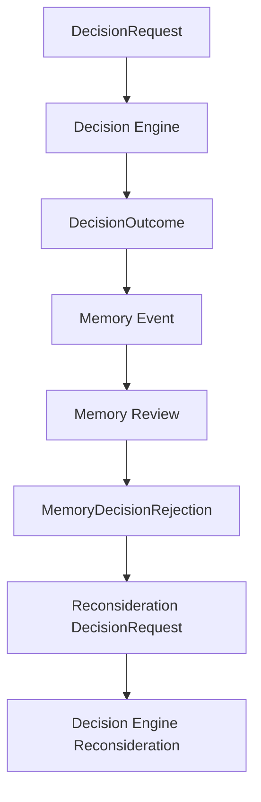

# Decision Memory Loop

Atlas decisions should become durable evidence. Memory records what the Decision Engine decided, then uses those records to challenge future proposals when past evidence contradicts a new action.

## Purpose

The loop prevents Atlas from repeating known-bad decisions while keeping authority in the right place.

Memory does not silently override execution. If Memory rejects a decision, the rejection reason is sent back to the Decision Engine for reconsideration.

## Package Boundary

Initial implementation:

```text
@atlas-aios/memory
```

Primary functions:

```ts
recordDecisionOutcomeAsMemoryEvent(input);
createDecisionRequestFromMemoryRejection(input);
```

## Flow



## Rule

```text
If Memory rejects a proposed decision:
  send the original action back to the Decision Engine
  include the Memory rejection reason
  include Memory evidence refs
  include a memory_rejection risk
```

The default deterministic engine rejects blocking Memory rejections and preserves the reason in the final rationale.

## Why This Matters

Memory is evidence, not authority. The Decision Engine remains the place where Atlas decides whether to proceed, discuss, simulate, reject, or delegate.

This keeps the system auditable:

```text
Prior event -> Memory rejection reason -> Decision Engine reconsideration -> final outcome
```
