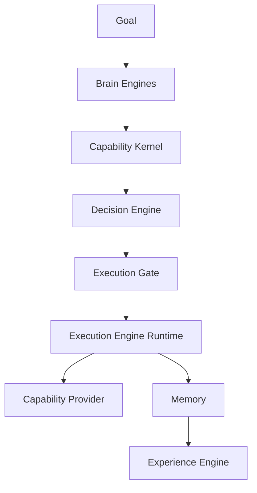

# Execution Gate

The Execution Gate is the contract between the Decision Engine and the Execution Engine.

Atlas may be technically capable of many actions, but execution must carry a decision outcome before the runtime calls a provider or interface driver. The gate does not decide whether an action is wise. It translates an already-issued `DecisionOutcome` into execution readiness.

## Package

Initial implementation:

```text
@atlas-aios/execution-engine
```

Primary function:

```ts
evaluateExecutionGate(request): ExecutionGateOutcome
```

## Flow



## Gate Mapping

| Decision outcome           | Gate status                | Execution status          | Required action            |
| -------------------------- | -------------------------- | ------------------------- | -------------------------- |
| `approve`                  | `allowed`                  | `ready`                   | `execute`                  |
| `approve_with_constraints` | `allowed_with_constraints` | `ready`                   | `execute_with_constraints` |
| `discuss`                  | `waiting`                  | `waiting_for_discussion`  | `discuss`                  |
| `suggest_alternative`      | `waiting`                  | `waiting_for_alternative` | `revise_plan`              |
| `simulate_first`           | `waiting`                  | `waiting_for_simulation`  | `simulate`                 |
| `reject`                   | `blocked`                  | `blocked_by_decision`     | `stop`                     |
| `delegate_to_human`        | `waiting`                  | `waiting_for_human`       | `delegate`                 |

## Rules

- Provider execution must not start without an execution gate outcome.
- The Execution Gate must preserve the Decision Engine rationale, evidence refs, audit severity, constraints, discussion points, suggested alternative, and simulation requirement.
- The Execution Gate must not override or soften a rejection.
- The Execution Gate must not invent approval that the Decision Engine did not issue.
- Future runtime state machines should treat the gate output as the first execution transition.

## Why This Boundary Exists

The Decision Engine owns judgment. The Execution Engine owns scheduling, retries, compensation, checkpoints, and runtime state.

The gate prevents those concerns from blending. It makes the handoff explicit:

```text
DecisionOutcome -> ExecutionGateOutcome -> execution state transition
```

This also gives Memory and Experience a stable place to observe decisions before execution results are known.

## Runtime Plan Runs

Runtime plan orchestration evaluates one gate per AtlasPlan step. It does not execute
part of a plan while another step is waiting. Once every step is allowed, Runtime
compiles the resolved steps and exact inputs into one sequential AtlasFlow and passes
that workflow to Execution Engine.

`simulate_first` runs only the Interface Driver simulation path. The resulting
evidence is sent back through Decision Engine. Human approval is separately verified
before the reconsidered `approve_with_constraints` outcome can reach execution.
