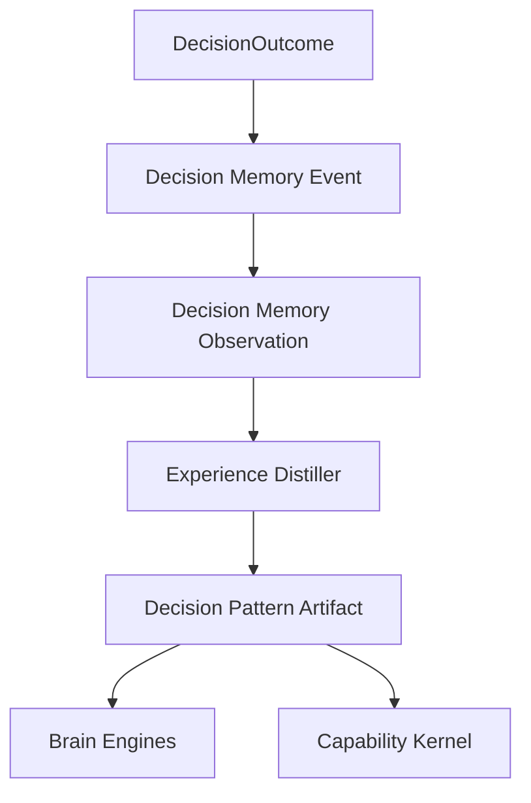

# Experience Distillation

Experience is distilled knowledge, not raw memory replay.

Memory records what happened. The Experience Engine turns repeated evidence into reusable artifacts such as decision patterns, heuristics, playbooks, anti-patterns, and risk patterns.

## Initial Package

```text
@atlas-aios/experience
```

Initial implemented function:

```ts
distillDecisionPatternsFromMemory(input);
lookupExperienceArtifacts(input);
```

## Decision Pattern Distillation

The first distillation path converts repeated decision observations into `decision_pattern` artifacts.

An observation contains:

- Memory event id
- action type
- decision outcome type
- rationale
- risk kinds
- applicability scope
- occurred-at timestamp

Atlas only creates a decision pattern when the same scoped decision signal appears enough times. The default minimum evidence count is `2`.

## Anti-Overgeneralization Rule

Atlas must not merge decision evidence just because the action names are similar.

Patterns are grouped by:

- action type
- outcome type
- risk kinds
- exact applicability scope

This means repeated `Create Resource` rejections for one provider do not automatically become a global rule for all providers.

## Flow



## Lookup API

The Experience package exposes a scoped lookup API:

```ts
lookupExperienceArtifacts({
  artifacts,
  query: {
    artifactTypes,
    applicability,
    minimumConfidence
  }
});
```

The lookup contract is intentionally scope-first. A result must match every requested applicability scope. This allows Atlas to ask for broad planning guidance, such as `capability:create-resource`, or provider-specific evidence, such as `capability:create-resource` plus `provider:billing-api`.

Results are sorted by confidence, then by id for deterministic ordering.

## Brain Integration

Brain Engines use `lookupPlanningExperience` to ask:

```text
What prior Experience should shape this plan for these capabilities?
```

The Brain lookup currently returns guidance grouped by capability id. It does not own or mutate Experience artifacts.

## Capability Kernel Integration

The Capability Kernel uses `lookupProviderExperience` to ask:

```text
What prior Experience exists for this capability/provider candidate?
```

The Kernel can also call `rankProviderCandidates` to apply Experience to candidate scoring.

Negative Experience, such as anti-patterns, risk patterns, or decision patterns that repeatedly led to rejection, reduces adjusted confidence and increases adjusted risk. Positive Experience, such as playbooks and heuristics, gives a smaller confidence boost and a small risk reduction.

This asymmetry is intentional. Prior harm should influence provider choice more strongly than prior convenience.

The initial ranking output includes:

- adjusted confidence
- adjusted risk score
- Experience adjustment
- cost penalty
- latency penalty
- ranking score
- Experience artifact ids used as evidence

Cost and latency are now included as explicit penalties in the ranking score. Permission fit, policy fit, and provider reputation remain separate future ranking inputs.

## Artifact Shape

Decision pattern artifacts include:

- artifact id
- artifact type
- summary
- evidence memory event ids
- applicability scope
- confidence score

Confidence starts conservatively and increases with repeated evidence. It is not a replacement for governance review.

## Current Boundary

This slice implements decision pattern distillation plus lookup contracts for Brain Engines and the Capability Kernel.

Future slices should add:

- staleness and review policy
- risk pattern artifacts
- permission, policy, and reputation scoring
- governance review for high-impact artifacts
