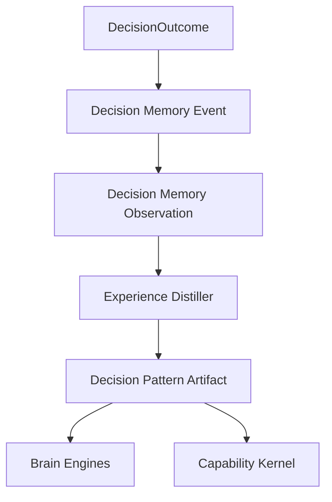

# Experience Distillation

Experience is distilled knowledge, not raw memory replay.

Memory records what happened. The Experience Engine turns repeated evidence into reusable artifacts such as decision patterns, heuristics, playbooks, anti-patterns, and risk patterns.

## Initial Package

```text
@atlas-aios/experience
```

Initial implemented function:

```ts
distillDecisionPatternsFromMemory(input);
```

## Decision Pattern Distillation

The first distillation path converts repeated decision observations into `decision_pattern` artifacts.

An observation contains:

- Memory event id
- action type
- decision outcome type
- rationale
- risk kinds
- applicability scope
- occurred-at timestamp

Atlas only creates a decision pattern when the same scoped decision signal appears enough times. The default minimum evidence count is `2`.

## Anti-Overgeneralization Rule

Atlas must not merge decision evidence just because the action names are similar.

Patterns are grouped by:

- action type
- outcome type
- risk kinds
- exact applicability scope

This means repeated `Create Resource` rejections for one provider do not automatically become a global rule for all providers.

## Flow



## Artifact Shape

Decision pattern artifacts include:

- artifact id
- artifact type
- summary
- evidence memory event ids
- applicability scope
- confidence score

Confidence starts conservatively and increases with repeated evidence. It is not a replacement for governance review.

## Current Boundary

This slice implements decision pattern distillation only.

Future slices should add:

- staleness and review policy
- risk pattern artifacts
- Experience lookup API for Brain Engines
- Experience lookup API for Capability Kernel
- governance review for high-impact artifacts
